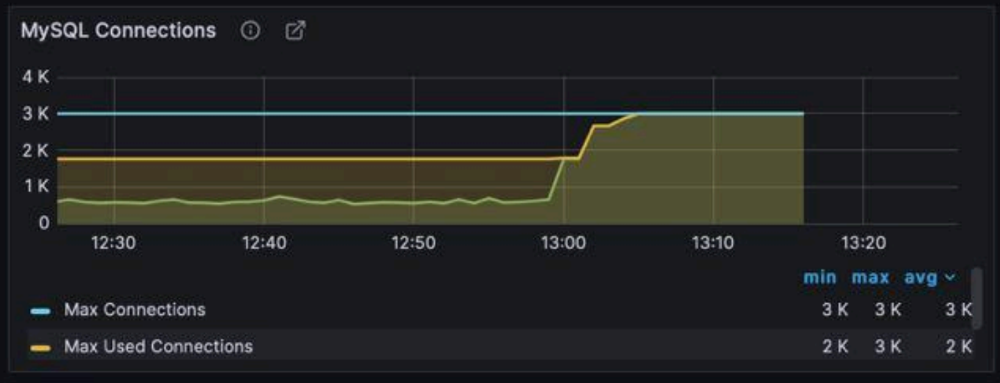
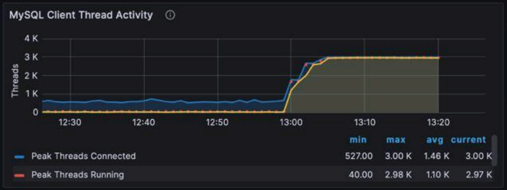
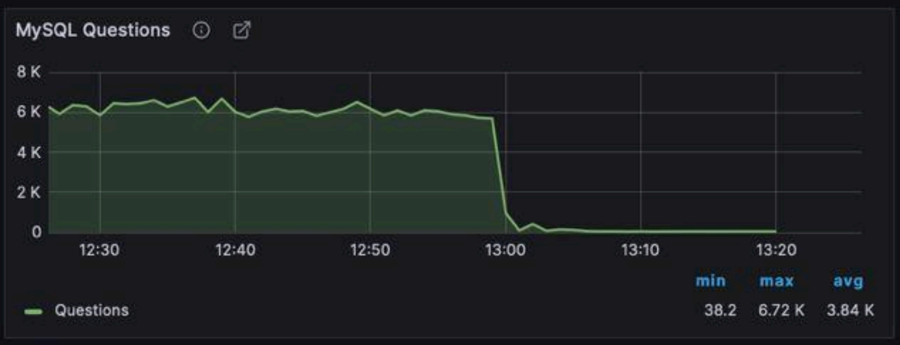
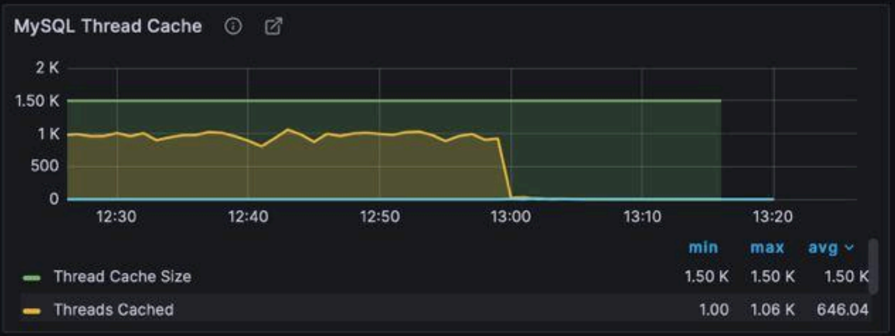

# Задача 3 - разбор недоступности сервиса по графикам MySQL

## Краткий ответ

> **Вероятная причина** недоступности сервиса - MySQL перестала нормально обслуживать запросы из-за очень сильной деградации по подключениям и потокам

## Что вообще дано

Есть 4 графика мониторинга MySQL. Требуется понять, что примерно произошло, когда всё поехало и какая наиболее вероятная причина недоступности

## Скриншоты

### MySQL Connections

### MySQL Client Thread Activity

### MySQL Questions

### MySQL Thread Cache

## Что видно по графикам

### 1. MySQL Connections

`Max Connections` - всё время на 3K

`Max Used Connections` - до примерно 13:00 был заметно ниже, а потом начал быстро расти и дошёл до 3K

То есть в момент деградации MySQL практически упёрся в потолок по подключениям

### 2. MySQL Client Thread Activity

До примерно 12:59 `Threads Connected` был меньше 1K, а `Threads Running` почти около нуля

Потом оба графика резко пошли вверх и к 13:05 почти дошли до 3K

**Это уже плохой признак**. Не просто выросло количество подключений, а почти все потоки стали заняты работой (ну или зависли в активном состоянии)

### 3. MySQL Questions

До примерно 12:59 значение держалось около 6K

Потом за пару минут график почти падает в ноль

Вывод. Полезная обработка запросов резко просела. То есть система почти перестала нормально обслуживать запросы

### 4. MySQL Thread Cache

`Thread Cache Size` всё время около 1.5K

`Threads Cached` до инцидента держался около 1K, а затем быстро упал почти в ноль

Доп признак того, что MySQL резко ушёл в тяжёлый режим по потокам

## Итог по ситуации

По графикам видно, что примерно с 12:59-13:00 у MySQL началась резкая деградация (и так и не восстановилась)   

К примерно 13:05 база MtSQL практически упёрлась в лимиты по подключениям и потокам:
- соединения выросли почти до 3K
- running threads выросли (тоже) почти до 3K
- `Questions` почти упали в ноль

**Вероятная причина** недоступности сервиса - MySQL перестала нормально обслуживать запросы из-за очень сильной деградации по подключениям и потокам

Гипотезы причин (но тут данных вообще мало, нужно дальше собирать информацию и анализировать):
- всплеск кол-ва соединений со стороны приложений
- очень медленные или зависшие запросы
- часть запросов начала ждать друг друга и мешать друг другу работать
- приложение не закрывало соединения нормально, из-за чего они накапливались
- проблемки с ресурсами хоста с MySQL (упёрся в потолок по железу и пошёл в отказ)

Точную корневую причину по этим 4 графикам доказать нельзя **(да в целом в задаче и не просили более глубокую причину найти, но той поверхностной причины явно недостаточно для починки или хотя бы начала починки [ну если мы не считаем сильным ходом просто хост ребутнуть или пересоздать])**

## Когда началась проблема

По графикам перелом начинается примерно в 12:59-13:00

К 13:05 состояние явно аварийное

До конца окна наблюдения (примерно до 13:20) восстановления не видно на графиках

## Чего критически не хватает для анализа

Для нормального RCA тут очень не хватает:

1. Типа жалоб пользователей или приложений (пятисотые, ошибки подключения к БД, отвал сервиса или части сервиса и тп.)

2. Логов приложения

3. MySQL логов

4. Метрик хоста MySQL (CPU, RAM, disk IO, сеть и тп.)

5. Информации о релизах, всплеске нагрузки или фоновых джобах в этот момент
